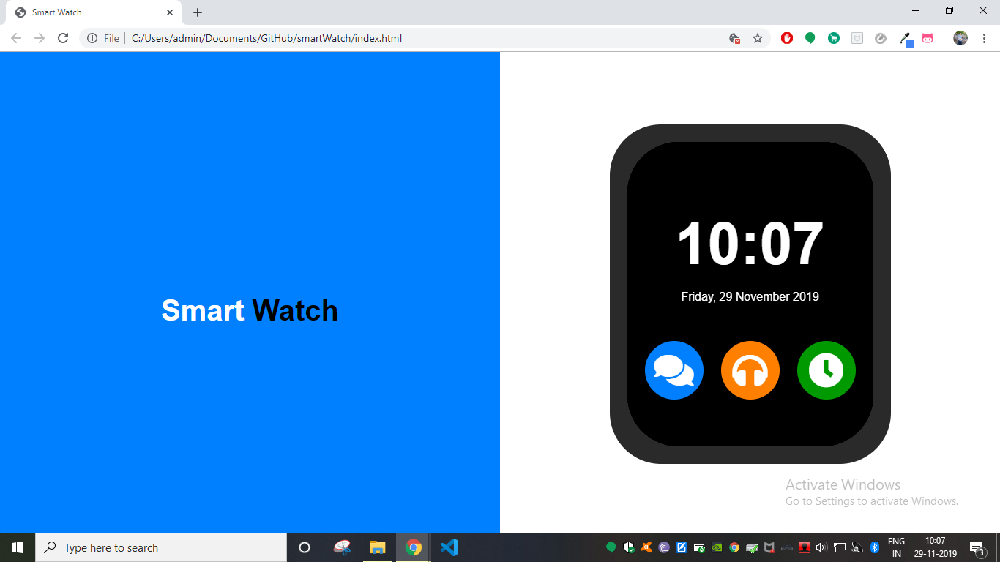
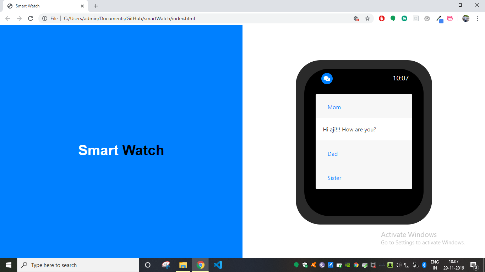
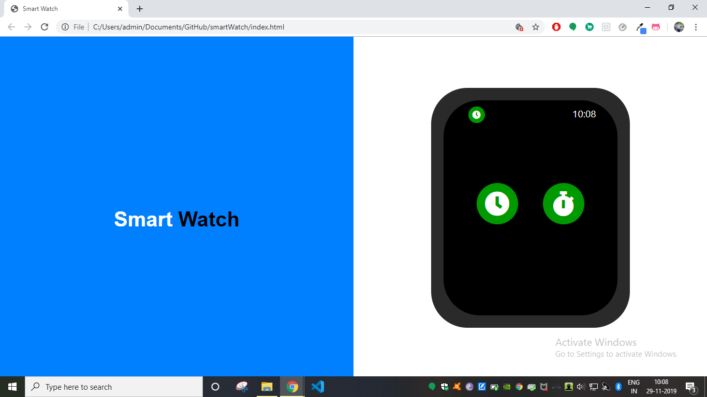
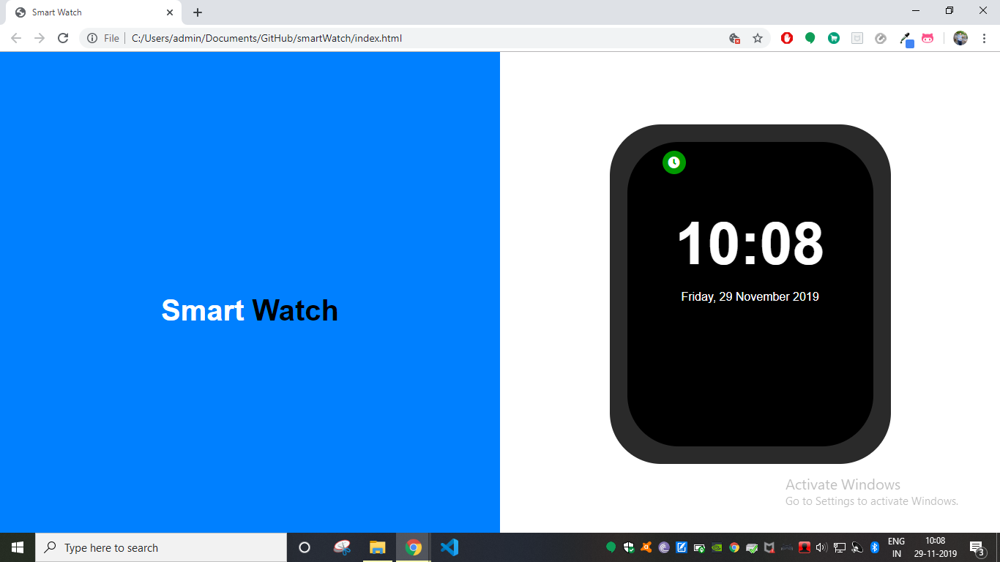
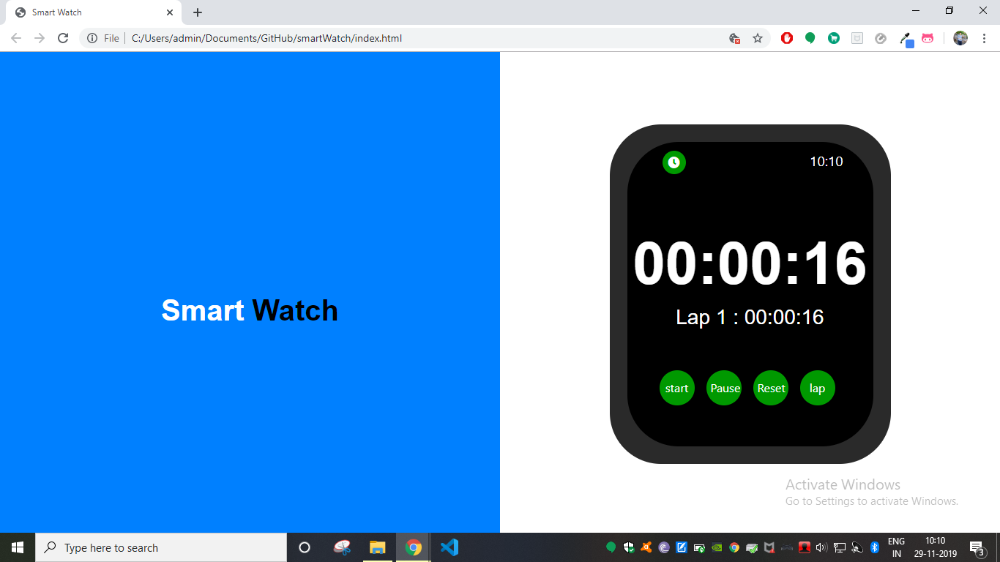

# Smart Watch V 1.0.0

Time is one of the most complicated topics but the interesting fact is that it is related to each and every one in this universe.History has witnessed many eras of time keeping. Few notable eras are the sundial era, the sandclock era, clock tower era, etc. Now people are living in the smart watch era. Being obsessed with technology, mankind has added all sorts of comforts within a small device, watch. It is then called the Smart Watch. This is a project on Smart Watch that has three basic functionaliities 1. Time and Stopwatch 2. Message Viewer 3. Music Player 

## Getting Started

Follow steps below to download and run this project in local machine
1. Click on 'Clone or download'
2. CLick 'Download ZIP'
3. Extract the .zip file to the preferred location.

### Prerequisites

* html
* css
* javascript

## Working

1. Open the index.html to start the application

2. Click on the messages button to open the messages screen.

3. Double click on the small icon on the top left corner to go back to Home screen.

4. Click on the music button to open music screen.

5. Click on the clock button to open the time screen.

6. Click on the clock button to see time.

7. Click on the Stopwatch button to open stop watch.

8.CLickon the start button to start, stop to stop and lap button to count lap.

## Author

[**Ajith C Ravi**](https://github.com/ajithcravi)

